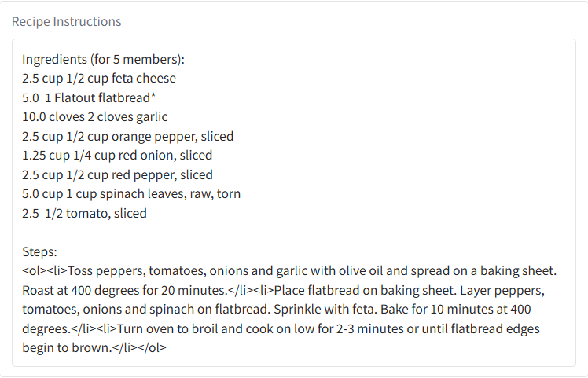

# ChefBot – AI-Powered Recipe Generator 🍲🤖

ChefBot is a Python-based AI application that generates delicious recipes based on the ingredients you provide. Whether you're in the kitchen or just curious, ChefBot helps you whip up ideas in seconds.
It is built using Python, Gradio, and Spoonacular API. It helps users discover recipes, explore similar dishes, fetch trending YouTube videos for cooking tutorials, and even listen to the recipe via speech synthesis.

---

**Technologies Used**

1. Python
2. Gradio
3. gTTS (Google Text-to-Speech)
4. Spoonacular API
5. YouTube Data API (optional placeholder used in UI)

---

## 🔍 Features

| Feature | Description |
|--------|-------------|
| 🧠 AI Recipe Generator | Uses OpenAI/GPT to generate custom recipes |
| 🥦 Ingredient-Based | Enter available ingredients to get matching recipes |
| 📋 Step-by-step Output | Provides cooking steps in natural language |
| 🗣️ Voice-enabled (optional) | Accepts voice input for ingredients |
| 📱 Jupyter Notebook Interface | Easy to experiment, test, and expand |

---

**Installation**
Clone the repository:

bash
Copy
Edit
git clone https://github.com/yourusername/chefbot.git
cd chefbot
Install dependencies:

bash
Copy
Edit
pip install gradio gtts requests Pillow
Add your Spoonacular API key in the script:

python
Copy
Edit
api_key = "your_spoonacular_api_key"

---

**▶️ How to Run**
Run the notebook or launch the Gradio app:

bash
Copy
Edit
python app.py
Or open the .ipynb file in Jupyter and run all cells.

---

.

**📸 Demo**

### 🧑‍🍳 User Input  

### 🍽️ Dish Image  

### 🧠 Instructions  

### 🔉 Audio & Similar Recipes  

### 🎬 YouTube Video  

